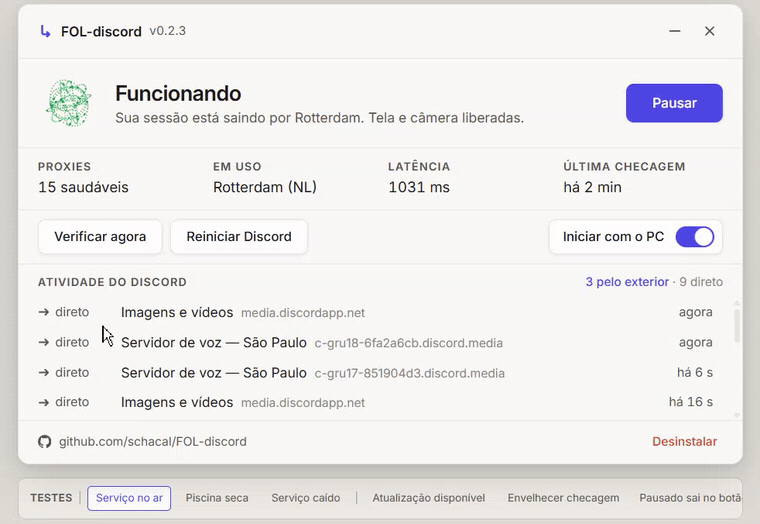

<p align="center">
  
</p>

<p align="center">
  Devolve a <b>transmissão de tela</b> e a <b>câmera</b> do Discord no Brasil.<br>
  Sem VPN, sem conta, sem mensalidade, sem administrador, sem perder ping. Instala e esquece.
</p>

<p align="center">
  <a href="https://github.com/schacal/FOL-discord/releases/latest"></a>
  <a href="https://github.com/schacal/FOL-discord/actions"></a>
  
  
</p>

---

## Demonstração

<p align="center">
  
</p>

Uma prévia curta da janela de gerenciamento: ela mostra quando a correção está ativa, permite pausar sem mexer na instalação e deixa claro quais conexões saem pelo exterior.

## Instalar

### Pelo aplicativo do Windows

Baixe e abra `FOL-discord_0.2.4_x64-setup.exe`. É um setup por usuário: não
pede administrador, instala a interface e o serviço no seu perfil, abre a
janela normal uma vez e registra a desinstalação no Windows. Ele usa o runtime
normal do WebView2; só baixa o bootstrapper da Microsoft se ele não existir.

Nos próximos logons, a tarefa `FolDiscord.Bandeja` abre a interface instalada
oculta, mostra primeiro o ícone âmbar **FOL-discord — preparando** e inicia o
serviço sem reiniciar o Discord.

Fechar a janela só a esconde na bandeja; a correção continua em execução. Use
**Desinstalar** dentro dela para remover tudo de forma guiada.

### Pelo PowerShell

Abra o **PowerShell** e cole:

```powershell
irm https://raw.githubusercontent.com/schacal/FOL-discord/main/install.ps1 | iex
```

Esse é o caminho avançado de serviço por linha de comando. Ele mantém o
autostart legado em `Run`; para a experiência completa de janela, bandeja e
desinstalação pelo Windows, prefira o setup.

A partir daí funciona por conta própria — em todo reinício do PC, em toda abertura do Discord, e nas reconexões que ele faz sozinho no meio do uso. Até você desinstalar.

**Não precisa** de administrador, VPN, conta, Python, .NET ou qualquer outra instalação.

## Desinstalar

```powershell
fol-discord desinstalar
```

Devolve o proxy automático do Windows ao valor anterior, tira o programa do PATH e apaga a pasta. Sem rastro.

## Contexto

O Discord vem enfrentando pendências jurídicas no Brasil. Não é assunto deste repositório e não vamos entrar no mérito.

O que interessa aqui é o efeito prático que muita gente passou a sentir: **a transmissão de tela e a câmera pararam de funcionar.**

Este programa contorna esse efeito de forma rápida, sem perda de ping e sem abrir mão da sua segurança. O mecanismo é o mesmo que já se fazia na mão — abrir o Discord com uma VPN ligada e desligar depois — só que automático, permanente e sem VPN nenhuma.

## O que ele resolve

O Discord decide a região da sua sessão pelo IP que enxerga **no momento em que abre**. Essa decisão fica valendo para a sessão inteira, e quando ela sai errada a transmissão de tela e a câmera param.

A solução manual conhecida era abrir o Discord com VPN ligada e desligar depois. Isto faz o mesmo, sozinho, sem VPN, e só com as conexões que realmente decidem a região.

| Sai por um IP estrangeiro | Sai direto, como sempre |
| --- | --- |
| `discord.com` | **Áudio, câmera e transmissão de tela** |
| `gateway.discord.gg` | `cdn.discordapp.com` e imagens |
| `latency.discord.media` | Todo o resto da internet |

São 14 conexões e alguns kilobytes na abertura.

**O ping não muda.** A voz e a tela viajam em UDP e nunca passam pelo proxy — o proxy do Windows só afeta TCP. E o servidor de voz que você recebe continua sendo o brasileiro: nos testes, `c-gru17` e `c-gru18`, ou seja, São Paulo.

## A janela

A versão para Windows inclui uma **janela de gerenciamento** e um ícone de
bandeja. Ela instala o serviço embutido na primeira abertura e mostra o estado
real da instalação, do PAC, da inicialização com o PC e da piscina de proxies.

| Controle | O que faz |
| --- | --- |
| **Pausar / Retomar** | desliga ou religa o PAC do Windows, sem remover a instalação |
| **Verificar agora** | confirma o estado e religa o serviço se ele estiver parado |
| **Reiniciar Discord** | fecha e abre apenas o Discord; não reinstala nem espera a piscina de proxies |
| **Iniciar com o PC** | cria ou remove a tarefa `FolDiscord.Bandeja`, que abre a interface instalada com `--bandeja` |
| **Desinstalar** | abre o desinstalador do Windows, que restaura o proxy anterior e remove somente a tarefa, PATH, serviço e arquivos do FOL |

Os processos auxiliares são iniciados sem janela de terminal. Fechar o aplicativo
só o esconde na bandeja; o serviço continua corrigindo com a janela fechada.

O serviço também continua independente dela: sobe com o Windows e pode ser
controlado pela linha de comando.

## Comandos

O instalador coloca o programa no seu PATH. **Abra um terminal novo** e os comandos abaixo funcionam direto:

```powershell
fol-discord status        # mostra o estado atual
fol-discord instalar      # liga a correção e reinicia o Discord
fol-discord desinstalar   # remove tudo
fol-discord reiniciar-discord # fecha e abre só o Discord
fol-discord rodar         # roda em primeiro plano, para depurar
```

Se o terminal responder `não é reconhecido como nome de cmdlet`, ele ainda está com o PATH antigo. Abra uma janela nova, ou use o caminho completo:

```powershell
& "$env:LOCALAPPDATA\FolDiscord\fol-discord.exe" status
```

Duas opções úteis:

```powershell
fol-discord instalar --sem-reiniciar   # não fecha o Discord que está aberto
fol-discord instalar --tudo-discord    # manda todo domínio do Discord pelo exterior
```

A segunda é rede de segurança, para o caso de a correção padrão não bastar na sua máquina.

## Documentação

| | |
| --- | --- |
| [**Como funciona**](docs/como-funciona.md) | O mecanismo por dentro, as quatro peças, e os caminhos que não funcionaram |
| [**Segurança**](docs/seguranca.md) | O que está protegido, o que fica exposto, e como verificar por conta própria |
| [**Problemas**](docs/problemas.md) | Quando não funciona, e o que olhar |

**Resumo de segurança:** o tráfego é HTTPS em túnel, então quem opera o proxy vê apenas *que* você falou com o Discord — nunca o conteúdo, nunca seu token, nunca suas mensagens. Nenhum certificado raiz é instalado, nenhum arquivo do Discord é modificado, e nada roda como administrador. A [página de segurança](docs/seguranca.md) explica também o que **fica** exposto, porque não é zero.

## Estrutura

```
fol-discord/
├── src/                    o serviço, em Rust
│   ├── main.rs        instalação, desinstalação, status, laço principal
│   ├── routing.rs     decide, por host, quem sai por fora
│   ├── socks.rs       o proxy local em 127.0.0.1:9250
│   ├── pool.rs        piscina de proxies públicos, com auto-cura
│   ├── pac.rs         o arquivo PAC que o Windows lê
│   ├── discord.rs     encontra e reinicia o Discord
│   └── windows.rs     registro: PAC, autostart, PATH — e como desfazê-los
├── interface/              a janela instaladora, em Tauri + React
│   ├── src/           a janela: estados, métricas, atividade
│   └── src-tauri/     a moldura, a bandeja e o ícone
├── docs/
├── assets/                 materiais visuais do repositório
│   ├── banner.png         capa do README
│   ├── demo.gif           demonstração breve da janela
│   └── icons/             ícone principal e ícone de bandeja
├── install.ps1
└── .github/workflows/release.yml
```

## Compilar

```bash
cargo build --release
```

Sai em `target/release/fol-discord.exe`. Os binários publicados em *Releases* são compilados pelo GitHub Actions a partir deste repositório — não são enviados da máquina de ninguém.

```bash
cargo test
```

A janela é um projeto à parte, em [`interface/`](interface/):

```bash
npm --prefix interface install
npm --prefix interface run dev
```

Isso abre a janela no navegador, no tamanho real, falando com um serviço simulado — dá para ver e testar os quatro estados sem Rust e sem proxy nenhum. Para compilar o aplicativo de verdade, `npm --prefix interface run tauri build`.

## Por que FOL?

Oficialmente: **F**az **O** **L**ink sair do país e voltar. Sai, dá a volta, volta — e aí o Discord funciona.

Extraoficialmente: sim, é **Faz o L**.

As duas leituras estão corretas e nenhuma das duas foi acidente.

## Licença

MIT. Veja [LICENSE](LICENSE).
