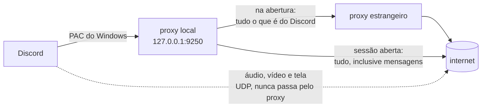

# Como funciona

## O problema no Brasil

O Discord decide a região da sua sessão **no momento em que abre**, a partir do IP que enxerga. Essa decisão fica valendo para a sessão inteira.

Em provedores brasileiros com peering ruim até a borda do Discord, essa decisão sai errada. O sintoma mais visível é a **transmissão de tela parar de funcionar** — mas o mesmo problema aparece como voz cortando ou chamadas que não conectam.

Dá para ver a decisão acontecendo. Este endpoint devolve a lista de regiões conforme o IP de quem pergunta, e não pede autenticação:

```bash
curl https://latency.discord.media/rtc
```

De uma conexão brasileira afetada, a resposta começa assim:

```json
[{"region":"brazil", ...}, {"region":"buenos-aires", ...}, {"region":"santiago", ...}]
```

Pela mesma conexão, saindo por um IP estrangeiro, a lista muda por completo — e a sessão passa a funcionar.

## A correção manual que já se fazia

Muita gente já tinha descoberto o jeito na mão: abrir o Discord com uma VPN ligada e desligar a VPN depois. Funciona, e o ping continua normal.

Isso funciona porque o IP estrangeiro só precisa estar presente **na abertura**. Depois disso, a sessão já está decidida.

O incômodo é ter que repetir isso toda vez — e o Discord reconecta sozinho de tempos em tempos, então a correção se perde no meio do uso sem aviso.

## O que este programa faz

A mesma coisa, sozinho: liga a "VPN" para o Discord abrir e desliga assim que a sessão nasceu. Enquanto a janela de abertura está aberta, **tudo o que é do Discord** sai por um IP estrangeiro; quando ela fecha, tudo volta a sair direto.



O ponto que faz isso valer a pena: **o áudio, o vídeo e a transmissão de tela viajam em UDP e não passam pelo proxy**. O proxy do Windows só afeta TCP.

Melhor ainda: o servidor de voz que você recebe continua sendo o brasileiro. Confirmado no log, o Discord entregou `c-gru17` e `c-gru18` — GRU é São Paulo.

## A janela de abertura

O IP estrangeiro é lido **uma vez**. Depois disso a região está gravada na sessão, e cada conexão que continuasse saindo por fora seria latência pura, comprando correção nenhuma.

Isso importa porque o `discord.com` e o `gateway.discord.gg` não são só endpoints de login: são o caminho das suas mensagens. O gateway é um websocket que fica de pé por horas e entrega toda mensagem que você recebe. Deixá-lo preso num proxy público gratuito custa caro. Medido nesta máquina, com o desvio permanente:

| | Direto | Pelo proxy |
| --- | --- | --- |
| `discord.com/api` | 0,06 s | 2,1 s |
| `gateway.discord.gg` | 0,20 s | 2,9 s a 11,3 s |

Por isso o desvio tem hora para acabar. O `src/sessao.rs` guarda em que fase a sessão está:

- **Abertura** — tudo o que é do Discord sai pelo exterior. É a VPN ligada.
- **Estabelecida** — tudo sai direto, sem exceção. É a VPN desligada.

A janela fecha depois de 30 segundos sem nenhuma conexão nova **que decida a região** — `discord.com`, o gateway e `latency.discord.media` —, com teto de 120 segundos. As outras conexões do Discord saem pelo exterior enquanto ela está aberta, mas não a seguram: se a CDN também contasse, um Discord em uso — trocando de canal, carregando imagem — nunca deixaria o silêncio completar, e a janela só fecharia pelo teto, dois minutos depois, no meio do uso. O que é desviado e o que alimenta o relógio são duas listas diferentes de propósito.

Os 30 segundos vêm de cronometrar uma abertura de verdade, não de chute:

```
[ 2.6s] Discord novo no ar
[10.0s] exterior  discord.com:443
[12.2s] exterior  gateway.discord.gg:443
[43.4s] exterior  latency.discord.media:443
[73.6s] sessão aberta; o Discord volta a falar direto
```

A abertura do Discord não é uma rajada contínua: entre o gateway e a última consulta de região passaram 31 segundos. Com uma janela de 10 segundos ela fechava no meio, e metade da abertura saía pelo IP brasileiro.

Três coisas seguram a janela aberta, porque cada uma delas já fez a correção se perder:

- **Piscina vazia.** No logon o serviço sobe antes de ter validado o primeiro proxy. Vencer nesse vão faria o Discord abrir sem correção pela sessão inteira.
- **Discord fechado.** A janela precisa estar aberta *antes* de ele voltar. O vigia olha de segundo em segundo e o Discord é mais rápido: medido, a primeira conexão chegou aos 2,4 s e o vigia só notou aos 2,6 s. Manter a janela aberta enquanto ele está fora elimina a corrida.
- **Aperto de mão em voo.** Um upstream morto segura uma conexão que decide a região por alguns segundos. Se a janela vencesse nesse meio tempo, o resto da abertura sairia direto. O aperto de mão com o proxy estrangeiro tem prazo de 5 segundos — TCP e SOCKS5 juntos — e uma segunda tentativa noutro proxy, então essa espera é curta por construção.

O preço disso é que tudo o que o Discord faz nesse primeiro minuto passa por um proxy público gratuito: as mensagens vêm devagar, as imagens demoram a carregar. Passado esse minuto, tudo é derrubado e volta pelo caminho curto, e assim fica pelo resto da sessão.

Há um custo mais específico: **começar uma transmissão de tela nesse minuto pode falhar**. A sinalização dela viaja pelo websocket do gateway, que é derrubado quando a janela fecha, e a transmissão perde o fio no meio. É inerente ao modelo — desligar a VPN corta as conexões — e é por isso que a janela fecha o mais cedo que dá, e por isso o relógio só ouve as conexões que decidem a região.

Ao fechar, o programa **derruba as conexões que ele mesmo abriu pelo exterior**. Não dá para mover uma conexão TCP viva de rota, então o jeito de tirar o gateway do proxy é fechá-lo: o Discord percebe, reconecta com `RESUME` — mesma sessão, mesma região — e agora pelo caminho curto. É exatamente o que acontece quando você desliga a VPN depois de abrir o Discord, que é a correção manual que este projeto automatiza.

A janela reabre quando o Discord reinicia. O programa identifica o Discord pelo processo principal — o único `Discord.exe` cujo pai não é outro `Discord.exe`; numa máquina comum são sete, um principal e seis filhos — e pela hora em que ele nasceu, porque o Windows reaproveita PIDs depressa o bastante para um Discord novo nascer com o número do antigo. Filho que nasce ou morre no meio do uso, como num Ctrl+R, não conta. Uma leitura vazia da lista de processos, que acontece sob carga, também não conta como "fechou": são precisas três seguidas. O botão **Reiniciar Discord** da janela cai nesse mesmo caminho.

Uma última coisa que o programa faz é só olhar. Se um gateway novo abrir mais de um minuto depois de o anterior cair, com a sessão já aberta — o PC dormiu, a internet caiu —, ele escreve no log que a sessão pode ter renascido pelo IP brasileiro. Não reinicia nada por conta disso: o programa não consegue ler a região da sessão em curso, e a consulta a `latency.discord.media/rtc` depois da janela responde `brazil` sempre, inclusive quando a sessão está certa. Reiniciar o Discord por palpite seria pior do que o problema.

## As peças

### 1. Proxy local (`src/socks.rs`)

Um servidor SOCKS5 em `127.0.0.1:9250`. É o único endereço que o Discord conhece. Para cada conexão ele consulta o roteamento e decide o caminho. O Discord não percebe diferença nenhuma.

Se não houver nenhum proxy estrangeiro disponível, ele entrega a conexão direto em vez de recusar. Perde-se a correção naquele momento, nunca a conexão — o Discord não fica offline por causa de um proxy morto.

### 2. Roteamento (`src/routing.rs`)

Decide, por host, quem sai por fora — e só enquanto a sessão está na fase de abertura:

| Sai pelo exterior, na abertura | Sai direto, sempre |
| --- | --- |
| `discord.com` e tudo abaixo dele, inclusive `status.discord.com` | `media.discordapp.net` — o PAC nunca o entrega ao proxy |
| `discord.gg`, com o gateway em todos os sabores regionais | todo o resto da internet |
| `discordapp.com`, inclusive a CDN | |
| `discord.media`, inclusive o TCP dos servidores de voz (`c-gru*`) | |

Com a sessão já aberta, a coluna da esquerda deixa de existir: `decidir` devolve `Direta` para tudo.

A regra é por domínio do Discord, nunca "qualquer host", e isso não é detalhe: o SOCKS local aceita conexão de qualquer programa da máquina. Se ele devolvesse `Exterior` sem olhar o host, viraria um relay estrangeiro de uso geral durante a janela. Os testes `resto_da_internet_vai_direto` e `nao_confunde_sufixo` são a guarda disso.

O mesmo módulo responde a uma segunda pergunta, separada da primeira: `decide_regiao` diz quais hosts alimentam o relógio que fecha a janela — `discord.com` (menos a página de avisos), o gateway e `latency.discord.media`. A voz por TCP e a CDN saem por fora, mas não seguram a janela, pelo mesmo motivo: o IP de origem dessas conexões não decide a região, e contá-las só manteria a janela aberta por mais tempo — a CDN, em particular, recebe conexão nova o tempo todo num Discord em uso.

### 3. Piscina de proxies (`src/pool.rs`)

Busca listas públicas de proxies SOCKS5 e valida cada candidato contra o próprio Discord. Um candidato só entra se atender três coisas ao mesmo tempo:

1. está de pé;
2. consegue falar com o Discord;
3. **não** cai na região `brazil`.

O terceiro item é o que torna a validação real: não adianta o proxy estar vivo se ele não muda a decisão do Discord.

A fila fica ordenada por latência. Quem falha em uso é rebaixado, e duas falhas eliminam. Quando a piscina fica com menos de três saudáveis, ela se reabastece sozinha — na hora, sem esperar a passada de manutenção de cinco minutos, porque com todo o Discord saindo pelo exterior na abertura uma piscina vazia é uma janela aberta sem para onde desviar. Você nunca configura nada.

### 4. Instalação via PAC (`src/pac.rs`, `src/windows.rs`)

Um arquivo PAC servido em `127.0.0.1:9251` diz ao Windows para entregar **só** o tráfego do Discord ao proxy local. Todo o resto responde `DIRECT` e nem passa por aqui.

O Windows aponta para esse arquivo por uma única chave de registro:

```
HKCU\Software\Microsoft\Windows\CurrentVersion\Internet Settings → AutoConfigURL
```

Foi a escolha certa por três motivos:

- o Discord relê o PAC em toda abertura, então a correção vale sempre;
- não é preciso mexer em atalho, então atualizações do Discord não quebram nada;
- é `HKCU`, então não precisa de administrador, e desinstalar é devolver o valor anterior.

Se já existia um `AutoConfigURL` na máquina, ele é guardado antes de ser trocado e devolvido na desinstalação.

### 5. A janela (`interface/`) — instalador e gerenciamento

O setup `FOL-discord_<versão>_x64-setup.exe` instala por usuário o aplicativo
Tauri e seu serviço sidecar. Na primeira abertura, a interface também copia o núcleo para
`%LOCALAPPDATA%\FolDiscord`, inicia-o em segundo plano e, depois de o serviço
subir, reinicia o Discord uma vez. Não depende de PowerShell, PATH, porta extra
ou de outro executável ao lado.

Nos logons seguintes, o Agendador executa
`FolDiscord.Bandeja -> "<fol-discord-janela.exe instalado>" --bandeja`.
Ela usa `InteractiveToken`, `LeastPrivilege` e `IgnoreNew`, portanto não roda
como administrador, SYSTEM ou antes do logon.

O webview conversa com o processo Tauri por IPC nativo. **Não existe API HTTP
na porta 9252.** As únicas portas locais do serviço são a SOCKS `9250` e a PAC
`9251`, ambas em `127.0.0.1`.

| Controle da janela | Implementação |
| --- | --- |
| Estado | consulta o processo instalado, o PAC, a tarefa de bandeja, o marcador de proxies e o log local |
| Atividade | mostra apenas as linhas `exterior` e `direto` do `fol.log`; mensagens de diagnóstico não aparecem como conexão |
| Última checagem | lê `ultima-validacao-ms`, carimbado pelo serviço a cada passada de manutenção da piscina e também pelo botão Verificar agora; um travessão quer dizer que nenhuma checagem terminou ainda |
| Pausar / Retomar | remove ou restaura `AutoConfigURL` no registro do usuário |
| Verificar agora | garante uma única inicialização do serviço quando ele está parado e atualiza o estado mostrado |
| Reiniciar Discord | usa o lançador do Discord diretamente; não reinstala nem aguarda a validação da piscina |
| Iniciar com o PC | cria ou remove `FolDiscord.Bandeja` e migra somente a entrada `Run` que aponta exatamente para o FOL |
| Desinstalar | abre o desinstalador NSIS registrado em `...\Uninstall\FOL-discord` (ou o `uninstall.exe` ao lado da interface), que remove a tarefa `FolDiscord.Bandeja` e chama a limpeza do núcleo antes de apagar a interface |

Fechar a janela a esconde na bandeja; o serviço continua. Os processos auxiliares
(`tasklist`, `taskkill`, o serviço e o lançador do Discord) usam criação sem
janela, portanto a instalação e a remoção não devem exibir terminais pretos.

Uma mudança do PAC pode ser percebida pelo WSL, se ele estiver configurado para
herdar o proxy do Windows. O aviso do WSL sobre alteração de proxy é externo ao
FOL-discord e não indica erro na correção.

## Caminhos que não funcionaram

Documentado para ninguém repetir o esforço:

**`chromiumSwitches` no `settings.json` do Discord.** Parecia a instalação perfeita — uma linha de JSON. Mas o Discord chama `app.commandLine.appendSwitch(chave)` **sem valor**, então `--proxy-server=...` é impossível por ali. Verificado na prática: com um proxy apontado para uma porta morta, o Discord conectou normalmente.

**Tor como fonte gratuita de IP estrangeiro.** Trava em 50% do bootstrap em provedores brasileiros pequenos e nunca fecha circuito. Testado por 25 minutos, zero circuitos. Além disso o Discord marca IPs de saída do Tor.

**Cloudflare — WARP ou Workers.** A hipótese era que as bases de geolocalização mapeariam a faixa da Cloudflare como EUA. Não mapeiam: a Cloudflare publica um geofeed correto por data center. Medido com o WARP ligado a partir do Brasil:

```
sem WARP : 170.82.x.x    BR
com WARP : 104.28.x.x    BR   (colo=GIG, loc=BR)
```

Você sai do Brasil e continua brasileiro. Isso vale igualmente para o truque de Workers com `cloudflare:sockets` — mesma rede anycast, mesmos data centers, mesmo geofeed.

**Limpar o cache do Discord.** Testado: apagar `Cache`, `Code Cache`, `GPUCache` e afins não corrige. O IP estrangeiro é necessário mesmo.
