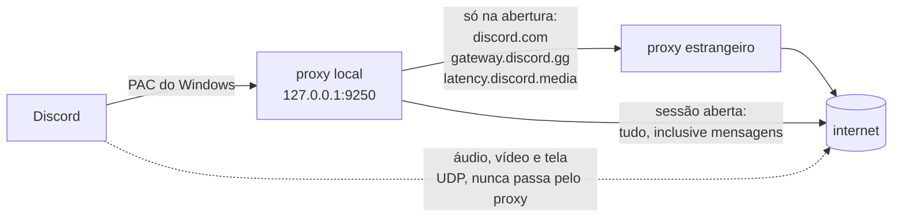

# Como funciona

## O problema no Brasil

O Discord decide a região da sua sessão **no momento em que abre**, a partir do IP que enxerga. Essa decisão fica valendo para a sessão inteira.

Em provedores brasileiros com peering ruim até a borda do Discord, essa decisão sai errada. O sintoma mais visível é a **transmissão de tela parar de funcionar** — mas o mesmo problema aparece como voz cortando ou chamadas que não conectam.

Dá para ver a decisão acontecendo. Este endpoint devolve a lista de regiões conforme o IP de quem pergunta, e não pede autenticação:

```bash
curl https://latency.discord.media/rtc
```

De uma conexão brasileira afetada, a resposta começa assim:

```json
[{"region":"brazil", ...}, {"region":"buenos-aires", ...}, {"region":"santiago", ...}]
```

Pela mesma conexão, saindo por um IP estrangeiro, a lista muda por completo — e a sessão passa a funcionar.

## A correção manual que já se fazia

Muita gente já tinha descoberto o jeito na mão: abrir o Discord com uma VPN ligada e desligar a VPN depois. Funciona, e o ping continua normal.

Isso funciona porque o IP estrangeiro só precisa estar presente **na abertura**. Depois disso, a sessão já está decidida.

O incômodo é ter que repetir isso toda vez — e o Discord reconecta sozinho de tempos em tempos, então a correção se perde no meio do uso sem aviso.

## O que este programa faz

A mesma coisa, sozinho: desvia as conexões que decidem a região, e desfaz o desvio quando a sessão já nasceu.



O ponto que faz isso valer a pena: **o áudio, o vídeo e a transmissão de tela viajam em UDP e não passam pelo proxy**. O proxy do Windows só afeta TCP.

Melhor ainda: o servidor de voz que você recebe continua sendo o brasileiro. Confirmado no log, o Discord entregou `c-gru17` e `c-gru18` — GRU é São Paulo.

## A janela de abertura

O IP estrangeiro é lido **uma vez**. Depois disso a região está gravada na sessão, e cada conexão que continuasse saindo por fora seria latência pura, comprando correção nenhuma.

Isso importa porque o `discord.com` e o `gateway.discord.gg` não são só endpoints de login: são o caminho das suas mensagens. O gateway é um websocket que fica de pé por horas e entrega toda mensagem que você recebe. Deixá-lo preso num proxy público gratuito custa caro. Medido nesta máquina, com o desvio permanente:

| | Direto | Pelo proxy |
| --- | --- | --- |
| `discord.com/api` | 0,06 s | 2,1 s |
| `gateway.discord.gg` | 0,20 s | 2,9 s a 11,3 s |

Por isso o desvio tem hora para acabar. O `src/sessao.rs` guarda em que fase a sessão está:

- **Abertura** — os hosts de controle saem pelo exterior.
- **Estabelecida** — tudo sai direto, sem exceção.

A janela fecha depois de 10 segundos sem nenhuma conexão de controle nova, com teto de 90 segundos. Ela não começa a contar enquanto a piscina estiver vazia: no logon o serviço sobe antes de ter validado o primeiro proxy, e deixar a janela vencer nesse vão faria o Discord abrir sem correção.

Ao fechar, o programa **derruba as conexões que ele mesmo abriu pelo exterior**. Não dá para mover uma conexão TCP viva de rota, então o jeito de tirar o gateway do proxy é fechá-lo: o Discord percebe, reconecta com `RESUME` — mesma sessão, mesma região — e agora pelo caminho curto. É exatamente o que acontece quando você desliga a VPN depois de abrir o Discord, que é a correção manual que este projeto automatiza.

A janela reabre quando o Discord reinicia. O programa compara os processos `Discord.exe` a cada segundo e re-arma quando nenhum dos anteriores sobrou — o que distingue um reinício de verdade de um renderizador que nasceu ou morreu no meio do uso. O botão **Reiniciar Discord** da janela cai nesse mesmo caminho.

## As peças

### 1. Proxy local (`src/socks.rs`)

Um servidor SOCKS5 em `127.0.0.1:9250`. É o único endereço que o Discord conhece. Para cada conexão ele consulta o roteamento e decide o caminho. O Discord não percebe diferença nenhuma.

Se não houver nenhum proxy estrangeiro disponível, ele entrega a conexão direto em vez de recusar. Perde-se a correção naquele momento, nunca a conexão — o Discord não fica offline por causa de um proxy morto.

### 2. Roteamento (`src/routing.rs`)

Decide, por host, quem sai por fora — e só enquanto a sessão está na fase de abertura:

| Sai pelo exterior, na abertura | Sai direto, sempre |
| --- | --- |
| `discord.com` | `cdn.discordapp.com` |
| `gateway.discord.gg` | `media.discordapp.net` |
| `latency.discord.media` | `status.discord.com` |
| | servidores de voz (`c-gru*.discord.media`) |
| | todo o resto da internet |

Com a sessão já aberta, a coluna da esquerda deixa de existir: `decidir` devolve `Direta` para tudo.

A separação é o que preserva o ping: a CDN é volume puro e a voz precisa de rota curta, então nenhuma das duas dá um passo a mais. O `status.discord.com` está na lista dos que nunca saem por fora porque casava com `discord.com` e ia parar no exterior sem comprar nada — é a página pública de avisos, não participa da decisão de região.

### 3. Piscina de proxies (`src/pool.rs`)

Busca listas públicas de proxies SOCKS5 e valida cada candidato contra o próprio Discord. Um candidato só entra se atender três coisas ao mesmo tempo:

1. está de pé;
2. consegue falar com o Discord;
3. **não** cai na região `brazil`.

O terceiro item é o que torna a validação real: não adianta o proxy estar vivo se ele não muda a decisão do Discord.

A fila fica ordenada por latência. Quem falha em uso é rebaixado, e duas falhas eliminam. Quando a piscina fica com menos de três saudáveis, ela se reabastece sozinha. Você nunca configura nada.

### 4. Instalação via PAC (`src/pac.rs`, `src/windows.rs`)

Um arquivo PAC servido em `127.0.0.1:9251` diz ao Windows para entregar **só** o tráfego do Discord ao proxy local. Todo o resto responde `DIRECT` e nem passa por aqui.

O Windows aponta para esse arquivo por uma única chave de registro:

```
HKCU\Software\Microsoft\Windows\CurrentVersion\Internet Settings → AutoConfigURL
```

Foi a escolha certa por três motivos:

- o Discord relê o PAC em toda abertura, então a correção vale sempre;
- não é preciso mexer em atalho, então atualizações do Discord não quebram nada;
- é `HKCU`, então não precisa de administrador, e desinstalar é devolver o valor anterior.

Se já existia um `AutoConfigURL` na máquina, ele é guardado antes de ser trocado e devolvido na desinstalação.

### 5. A janela (`interface/`) — instalador e gerenciamento

O setup `FOL-discord_<versão>_x64-setup.exe` instala por usuário o aplicativo
Tauri e seu serviço sidecar. Na primeira abertura, a interface também copia o núcleo para
`%LOCALAPPDATA%\FolDiscord`, inicia-o em segundo plano e, depois de o serviço
subir, reinicia o Discord uma vez. Não depende de PowerShell, PATH, porta extra
ou de outro executável ao lado.

Nos logons seguintes, o Agendador executa
`FolDiscord.Bandeja -> "<fol-discord-janela.exe instalado>" --bandeja`.
Ela usa `InteractiveToken`, `LeastPrivilege` e `IgnoreNew`, portanto não roda
como administrador, SYSTEM ou antes do logon.

O webview conversa com o processo Tauri por IPC nativo. **Não existe API HTTP
na porta 9252.** As únicas portas locais do serviço são a SOCKS `9250` e a PAC
`9251`, ambas em `127.0.0.1`.

| Controle da janela | Implementação |
| --- | --- |
| Estado | consulta o processo instalado, o PAC, a tarefa de bandeja, o marcador de proxies e o log local |
| Atividade | mostra apenas as linhas `exterior` e `direto` do `fol.log`; mensagens de diagnóstico não aparecem como conexão |
| Última checagem | lê `ultima-validacao-ms`, carimbado pelo serviço a cada passada de manutenção da piscina e também pelo botão Verificar agora; um travessão quer dizer que nenhuma checagem terminou ainda |
| Pausar / Retomar | remove ou restaura `AutoConfigURL` no registro do usuário |
| Verificar agora | garante uma única inicialização do serviço quando ele está parado e atualiza o estado mostrado |
| Reiniciar Discord | usa o lançador do Discord diretamente; não reinstala nem aguarda a validação da piscina |
| Iniciar com o PC | cria ou remove `FolDiscord.Bandeja` e migra somente a entrada `Run` que aponta exatamente para o FOL |
| Desinstalar | abre o desinstalador NSIS registrado em `...\Uninstall\FOL-discord` (ou o `uninstall.exe` ao lado da interface), que remove a tarefa `FolDiscord.Bandeja` e chama a limpeza do núcleo antes de apagar a interface |

Fechar a janela a esconde na bandeja; o serviço continua. Os processos auxiliares
(`tasklist`, `taskkill`, o serviço e o lançador do Discord) usam criação sem
janela, portanto a instalação e a remoção não devem exibir terminais pretos.

Uma mudança do PAC pode ser percebida pelo WSL, se ele estiver configurado para
herdar o proxy do Windows. O aviso do WSL sobre alteração de proxy é externo ao
FOL-discord e não indica erro na correção.

## Caminhos que não funcionaram

Documentado para ninguém repetir o esforço:

**`chromiumSwitches` no `settings.json` do Discord.** Parecia a instalação perfeita — uma linha de JSON. Mas o Discord chama `app.commandLine.appendSwitch(chave)` **sem valor**, então `--proxy-server=...` é impossível por ali. Verificado na prática: com um proxy apontado para uma porta morta, o Discord conectou normalmente.

**Tor como fonte gratuita de IP estrangeiro.** Trava em 50% do bootstrap em provedores brasileiros pequenos e nunca fecha circuito. Testado por 25 minutos, zero circuitos. Além disso o Discord marca IPs de saída do Tor.

**Cloudflare — WARP ou Workers.** A hipótese era que as bases de geolocalização mapeariam a faixa da Cloudflare como EUA. Não mapeiam: a Cloudflare publica um geofeed correto por data center. Medido com o WARP ligado a partir do Brasil:

```
sem WARP : 170.82.x.x    BR
com WARP : 104.28.x.x    BR   (colo=GIG, loc=BR)
```

Você sai do Brasil e continua brasileiro. Isso vale igualmente para o truque de Workers com `cloudflare:sockets` — mesma rede anycast, mesmos data centers, mesmo geofeed.

**Limpar o cache do Discord.** Testado: apagar `Cache`, `Code Cache`, `GPUCache` e afins não corrige. O IP estrangeiro é necessário mesmo.
